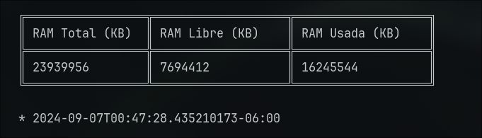
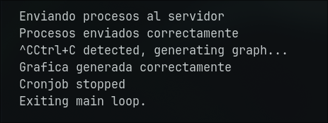

<h1 align="center">Proyecto 1</h1>

<p align="center"></p>

<div align="center">
🙍‍♂️ Joab Israel Ajsivinac Ajsivinac 🆔 202200135
</div>
<div align="center">
📕 Sistemas Operativos 1
</div>
<div align="center"> 🏛 Universidad San Carlos de Guatemala</div>
<div align="center"> 📆 Segundo Semestre 2024</div>

<br/> 

<h1 align="center">📍 Manual Técnico</h1>


## 📋 Tabla de Contenidos

- [📋 Tabla de Contenidos](#-tabla-de-contenidos)
- [⚙ Tecnologías Utilizadas](#-tecnologías-utilizadas)
- [📟 Instalación](#-instalación)
- [⚡ Inicio Rápido](#-inicio-rápido)
- [🧮 Como funciona](#-como-funciona)
- [📷 Capturas](#-capturas)


## ⚙ Tecnologías Utilizadas

<div align="center" style="display:flex;justify-content:center;gap:20px">
 <a href="https://skillicons.dev">
    
  </a>
</div>


<ul>
    <li>Sistemas Opreativos</li>
    <ul>
        <li>Linux: Ubuntu, Debian, CentOS, <b>Fedora</b>, etc.
        </li>
    </ul>
    <li>Rust 1.79.0 o Superior</li>
    <li><b>Librerías de Rust</b></li>
    <ul>
      <li>serde 1.0 o Superior</li>
      <li>serde_json 1.0 o Superior</li>
      <li>reqwest 0.12.7 o Superior</li>
      <li>tokio 1 o Superior</li>
      <li>chrono 0.4 o Superior</li>
      <li>ctrlc 3.2.0 o Superior</li>
    </ul>
    <li>Docker 27.1.2 o Superior</li>
    <li>gcc 14.1.1 o Superior</li>
    <li>Python 3.12.4 o Superior</li>
    <li><b>Librerías de Python</b></li>
    <ul>
      <li>fastapi 0.112.2 o Superior</li>
      <li>pandas 2.2.2 o Superior</li>
      <li>seaborn 0.13.2 o Superior</li>
      <li>numpy 2.0.2 o Superior</li>
    </ul>
    
</ul>

## 📟 Instalación
Descargue el código o bien clone el repositorio en una carpeta.

Si se opta por la clonación se hace con la siguiente linea de código en terminal (Antes de ejecutar el codigo asegurese de estar en la carpeta donde lo quiere descargar)

```bash
git clone https://github.com/J-Ajsivinac/SO1_2S2024_202200135.git
```

## ⚡ Inicio Rápido
Una vez se tenga descargado la aplicación, se debe dirigir a
 `/Proyecto1/module` y ejecutar el siguiente comando

```bash
  make
``` 

 luego dirijase a `/Proyecto1/rust_service`, para abrir una terminal, y ejecutar el siguiente comando ( si es la primera vez que se ejcuta la aplicación )

```bash
  cargo build
```

Si ya se hecho el build basta con usar el siguiente comando

```bash
  cargo run
```

AL ejecutarse se le pedira su contraseña de administrador para cargar el modulo de Kernle

## 🧮 Como funciona

El flujo de la aplicación es el siguiente:

---

### 1. Inicia un Cronjob que genera 10 contenedores cada minuto

El siguiente código ejecuta un script que configura un cronjob encargado de crear 10 contenedores cada minuto. Utiliza la función `std::process::Command` para ejecutar un archivo Bash en segundo plano, sin mostrar la salida en la terminal.

```rust
pub fn start_cronjob(path: &str) -> std::process::Child {
    let output = std::process::Command::new("sh")
        .arg(path)
        .stdin(Stdio::null())
        .stdout(Stdio::null())
        .stderr(Stdio::null())
        .spawn()
        .expect("failed to execute cronjob");
    output
}
```
- **Explicación**: Este cronjob asegura que siempre haya 10 contenedores activos en el sistema, generándolos automáticamente cada minuto. Esto es útil para simular o realizar pruebas de alta carga en contenedores.

---

### 2. Inicia el servicio que recupera los logs

Esta función inicia un servidor que utiliza `docker-compose` para gestionar servicios de Docker en segundo plano. El servidor se encarga de recolectar logs de los contenedores.

```rust
pub fn start_logs_server(path: &str) -> std::process::Child {
    println!("{}",&path.to_string());
    let output = std::process::Command::new("docker-compose")
        .arg("-f")
        .arg(path)
        .arg("up")
        .arg("-d")
        .stdin(Stdio::null())
        .stdout(Stdio::null())
        .stderr(Stdio::null())
        .spawn()
        .expect("failed to execute module");

    output
}
```
- **Explicación**: El servidor de logs se encarga de capturar y almacenar los registros de los contenedores en ejecución. Usamos `docker-compose` para levantar los servicios de manera eficiente, permitiendo manejar múltiples contenedores con facilidad.

---

### 3. Inicia el módulo de Kernel

Esta función carga un módulo de kernel personalizado utilizando el comando `insmod`. El módulo es responsable de recolectar métricas de los contenedores y los procesos.

```rust
pub fn start_module() -> std::process::Output {
    let output = std::process::Command::new("sudo")
        .arg("insmod")
        .arg("../module/sysinfo.ko")
        .output()
        .expect("failed to execute module");
    println!("Module started");
    output
}
```
- **Explicación**: El módulo de kernel se ejecuta a nivel del sistema operativo para capturar información crítica sobre el uso de recursos (CPU, memoria) de los contenedores. Es una pieza esencial para el monitoreo detallado de los procesos.

---

### 4. Analiza los procesos

**a) Ordenar los procesos**

Este código define el comportamiento para ordenar los procesos según el uso de CPU, memoria y otros factores, garantizando que los procesos con mayor uso de recursos se identifiquen rápidamente.

```rust
impl Ord for Process {
    fn cmp(&self, other: &Self) -> std::cmp::Ordering {
        self.cpu_usage
            .partial_cmp(&other.cpu_usage)
            .unwrap_or(std::cmp::Ordering::Equal)
            .then_with(|| {
                self.memory_usage
                    .partial_cmp(&other.memory_usage)
                    .unwrap_or(std::cmp::Ordering::Equal)
                    .then_with(|| {
                        self.vsz
                            .partial_cmp(&other.vsz)
                            .unwrap_or(std::cmp::Ordering::Equal)
                            .then_with(|| {
                                self.rss
                                    .partial_cmp(&other.rss)
                                    .unwrap_or(std::cmp::Ordering::Equal)
                            })
                    })
            })
    }
}
```
- **Explicación**: Aquí estamos ordenando los procesos principalmente por el uso de CPU, luego por el uso de memoria, y finalmente por el tamaño de la memoria virtual (VSZ) y la memoria física (RSS). Este ordenamiento ayuda a priorizar los procesos que consumen más recursos.

**b) Mantener los procesos de bajo consumo**

Este bloque de código filtra los procesos de bajo consumo de recursos y detiene aquellos que exceden un umbral determinado, exceptuando los que corresponden al servidor de logs.

```rust
if lowest_list.len() > 3 {
    for process in lowest_list.iter().skip(3) {
        let log_process = LogProcess {
            pid: process.pid,
            container_id: process.get_container_id().to_string(),
            name: process.name.clone(),
            vsz: process.vsz,
            rss: process.rss,
            memory_usage: process.memory_usage,
            cpu_usage: process.cpu_usage,
            action: "stop".to_string(),
            timestamp: formatted_date.to_string()
        };
        
        if !process.get_container_id().to_string().starts_with(&id_logs) {
            log_proc_list.push(log_process.clone());
            let _output = stop_container(&process.get_container_id());
        }
    }
} 
```
- **Explicación**: Se asegura que se mantengan solo los tres procesos de bajo consumo más importantes. El resto de los procesos son detenidos para liberar recursos.

**c) Mantener los contenedores de alto consumo**

Este fragmento de código detiene los contenedores que están utilizando demasiados recursos, permitiendo que solo los dos más importantes continúen en ejecución.

```rust
if highest_list.len() > 2 {
    for process in highest_list.iter().take(highest_list.len() - 2) {
        let log_process = LogProcess {
            pid: process.pid,
            container_id: process.get_container_id().to_string(),
            name: process.name.clone(),
            vsz: process.vsz,
            rss: process.rss,
            memory_usage: process.memory_usage,
            cpu_usage: process.cpu_usage,
            action: "stop".to_string(),
            timestamp: formatted_date.to_string()
        };
        
        if !log_process.container_id.starts_with(&id_logs) {
            log_proc_list.push(log_process.clone());
            let _output = stop_container(&process.get_container_id());
        }
    }
}
```
- **Explicación**: De forma similar a los procesos de bajo consumo, este código garantiza que solo los dos procesos de alto consumo más importantes sigan ejecutándose, deteniendo los demás para evitar una sobrecarga del sistema.

---

### 5. Detener todos los servicios y generar gráficas

Cuando el usuario presiona `Ctrl+C`, esta función detiene el cronjob que se ejecuta en segundo plano y genera gráficas a partir de los logs recolectados.

```rust
pub fn stop_cronjob() -> std::process::Output {
    let output = std::process::Command::new("crontab")
        .arg("-r")
        .output()
        .expect("failed to execute cronjob");
    println!("Cronjob stopped");
    output
}
```
- **Explicación**: Al detener el cronjob, se asegura que no se sigan generando más contenedores. Luego, se procesan los logs recolectados durante la ejecución y se generan gráficas, brindando una representación visual del uso de recursos.


## 📷 Capturas


* **Datos del consumo de memoria en General**



* **Tabla de contenendores de alto y bajo comsumo**


* **Finalización de la Aplicación**



* **Graficas Generadas**


