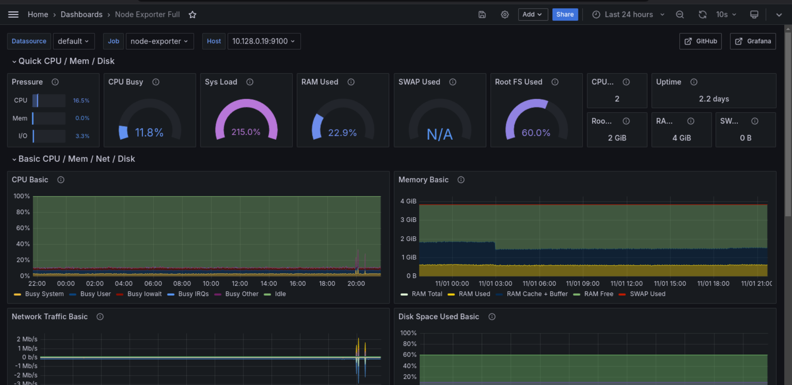

<h1 align="center">Proyecto 2</h1>

<p align="center"></p>

<div align="center">
🙍‍♂️ Joab Israel Ajsivinac Ajsivinac 🆔 202200135
</div>
<div align="center">
📕 Sistemas Operativos 1
</div>
<div align="center"> 🏛 Universidad San Carlos de Guatemala</div>
<div align="center"> 📆 Segundo Semestre 2024</div>

<br/> 

<br/> 

# ⚙ Tecnologías Utilizadas

<div align="center" style="display:flex;justify-content:center;gap:20px">
 <a href="https://skillicons.dev">
    
  </a>
</div>
<ul>
  <li>Kubernetes</li>
  <li>Go</li>
  <li>Rust</li>
  <li>Dockerr</li>
  <li>Helm</li>
  <li>GRPC</li>
  <li>Redis</li>
  <li>Grafana</li>
  <li>Prometheus</li>
  <li>Python</li>
  </ul>
</ul>


Este proyecto despliega y organiza servicios en un clúster de Kubernetes para monitorear y gestionar eventos de disciplinas deportivas. Utiliza un diseño modular, implementado mediante archivos de configuración YAML para facilitar la administración de recursos como namespaces, controladores de ingreso, servicios específicos por facultad y disciplina, así como componentes adicionales como Kafka, Redis, Grafana y Prometheus.


---

## 2. Archivos de Configuración

### 2.1 Namespace

**Archivo:** `namespace.yaml`

Define un namespace llamado `so1-proyecto2` que permite gestionar los recursos del proyecto de manera aislada.

```yaml
apiVersion: v1
kind: Namespace
metadata:
  name: so1-proyecto2
```

**Despliegue:**

```bash
kubectl apply -f namespace.yaml
```

---

### 2.2 Ingress

**Archivo:** `ingress.yaml`

Configura el ingreso para los servicios mediante el controlador de Ingress NGINX. Se recomienda usar Helm para gestionar la instalación.

#### Pasos de instalación:

1. Crear un namespace para NGINX Ingress:
   ```bash
   kubectl create ns nginx-ingress
   ```

2. Añadir el repositorio de NGINX Ingress y actualizar:
   ```bash
   helm repo add ingress-nginx https://kubernetes.github.io/ingress-nginx
   helm repo update
   ```

3. Instalar el controlador de Ingress:
   ```bash
   helm install nginx-ingress ingress-nginx/ingress-nginx -n nginx-ingress
   ```

4. Obtener la IP del Load Balancer:
   ```bash
   kubectl get services -n nginx-ingress
   ```

5. Configurar la IP en `spec.rules.host` del archivo `ingress.yaml` y aplicar:
   ```bash
   kubectl apply -f ingress.yaml
   ```

---

### 2.3 Facultades

**Archivos:** `agronomy.yaml` y `engineering.yaml`

Estos archivos despliegan los servicios y deployments para las facultades de Agronomía e Ingeniería.

#### Ejemplo de archivo (`agronomy.yaml`):

```yaml
apiVersion: apps/v1
kind: Deployment
metadata:
  name: agronomy-deployment
  namespace: so1-proyecto2
spec:
  replicas: 1
  selector:
    matchLabels:
      app: agronomy-app
  template:
    metadata:
      labels:
        app: agronomy-app
    spec:
      containers:
      - name: agronomy-app-container
        image: jajsivianc/go-agronomy:1.0.4
        ports:
        - containerPort: 8080  # El puerto que tu aplicación en Go escucha
        resources:
          limits:
            cpu: "0.2"
            memory: "40Mi"
---

apiVersion: v1
kind: Service
metadata:
  name: agronomy-service
  namespace: so1-proyecto2 
spec:
  selector:
    app: agronomy-app
  ports:
  - protocol: TCP
    port: 8080
    targetPort: 8080
  type: ClusterIP

```

**Despliegue:**

```bash
kubectl apply -f agronomy.yaml
kubectl apply -f engineering.yaml
```

---

### 2.4 Disciplinas

**Archivos:** `swimming.yaml`, `athletics.yaml`, `boxing.yaml`

Define los deployments y servicios para las disciplinas. Cada archivo crea un despliegue para una disciplina específica, aislada por namespace.

**Despliegue:**

```bash
kubectl apply -f swimming.yaml
kubectl apply -f athletics.yaml
kubectl apply -f boxing.yaml
```

---

### 2.5 Kafka

**Comandos para instalar Kafka usando Strimzi:**

1. Instalar Strimzi en el namespace `so1-proyecto2`:
   ```bash
   kubectl create -f 'https://strimzi.io/install/latest?namespace=so1-proyecto2' -n so1-proyecto2
   ```

2. Crear un clúster de Kafka persistente:
   ```bash
   kubectl apply -f https://strimzi.io/examples/latest/kafka/kafka-persistent-single.yaml -n so1-proyecto2
   ```

3. Verificar la instalación de Kafka:
   ```bash
   kubectl get pods -n so1-proyecto2
   ```

---

### 2.6 Consumers

**Archivos:** `winners.yaml`, `losers.yaml`

Define los deployments para los consumidores de Kafka, que procesan y clasifican los mensajes según las reglas del sistema.

**Despliegue:**

```bash
kubectl apply -f winners.yaml
kubectl apply -f losers.yaml
```

---

### 2.7 Redis

Para instalar Redis con Bitnami, ejecute los siguientes comandos:

1. Agregar el repositorio de Bitnami y actualizar:
   ```bash
   helm repo add bitnami https://charts.bitnami.com/bitnami
   ```

2. Instalar Redis en el namespace:
   ```bash
   helm install redis bitnami/redis -n so1-proyecto2
   ```

---

### 2.8 Grafana y Prometheus

#### Asignar permisos para GKE (opcional para Google Cloud Platform):

```bash
ACCOUNT=$(gcloud info --format='value(config.account)')
kubectl create clusterrolebinding owner-cluster-admin-binding \
    --clusterrole cluster-admin \
    --user $ACCOUNT
```

1. Agregar el repositorio de Prometheus y actualizar:
   ```bash
   helm repo add prometheus-community https://prometheus-community.github.io/helm-charts
   helm repo update
   ```

2. Instalar Prometheus y Grafana:
   ```bash
   helm install my-kube-prometheus-stack prometheus-community/kube-prometheus-stack
   ```

---

## 3. Ejemplo de Funcionamiento

### 3.1 Inyección de Tráfico con Locust

Este sistema utiliza Locust para simular tráfico y medir la capacidad de respuesta de los servicios configurados. Locust se integra mediante gRPC para generar tráfico controlado y evaluar el desempeño del sistema.


### 3.2 Dashboard de Prometheus

Prometheus se usa para recolectar y almacenar métricas de rendimiento en los distintos servicios, permitiendo la visualización de estadísticas de uso y estado en tiempo real.



### 3.3 Dashboard de Redis en Grafana

Grafana, conectado con Redis y Prometheus, permite visualizar datos en un entorno gráfico y configurar alertas personalizadas. Las métricas de Redis muestran:
 
- Alumnos por facultad
- Ganadores Por disciplina
- Perdedores por disciplina
- Perdedores por facultad


