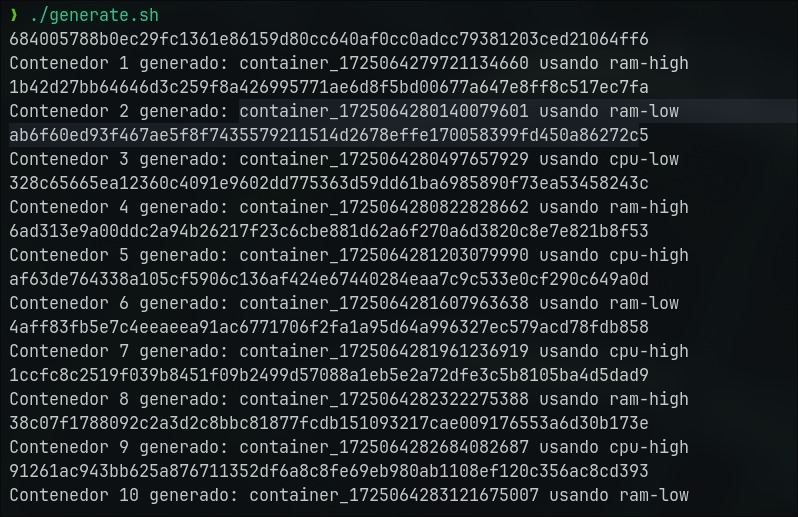
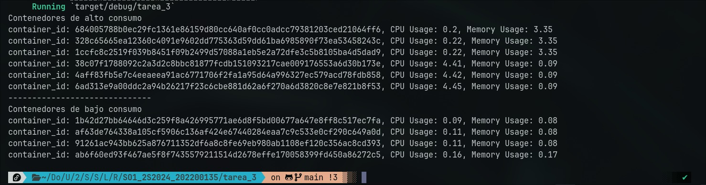

# Tarea 3

# Generación de los contenedores

la generación de imagenes genero los siguientes contenedores:

* Contenendores de alto consumo: **6**
    - 684005788b0e
    - 328c65665ea1
    - 6ad313e9a00d
    - 4aff83fb5e7c
    - 1ccfc8c2519f
    - 38c07f178809
* Contenendores de bajo consumo: **4**
    - 1b42d27bb646
    - ab6f60ed93f4
    - af63de764338
    - 91261ac943bb

# Servicio de rust corriendo

La separacion de contenendores de alto y bajo consumo coincide con la informacion generada por el script